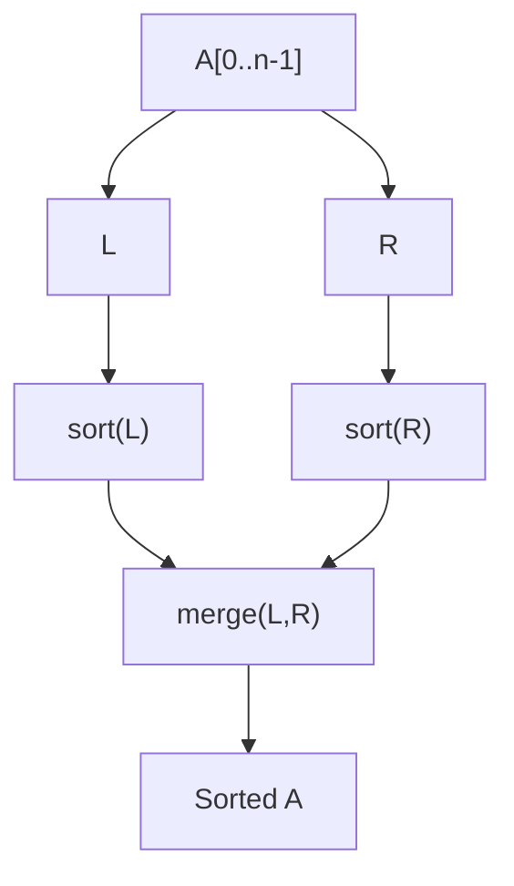
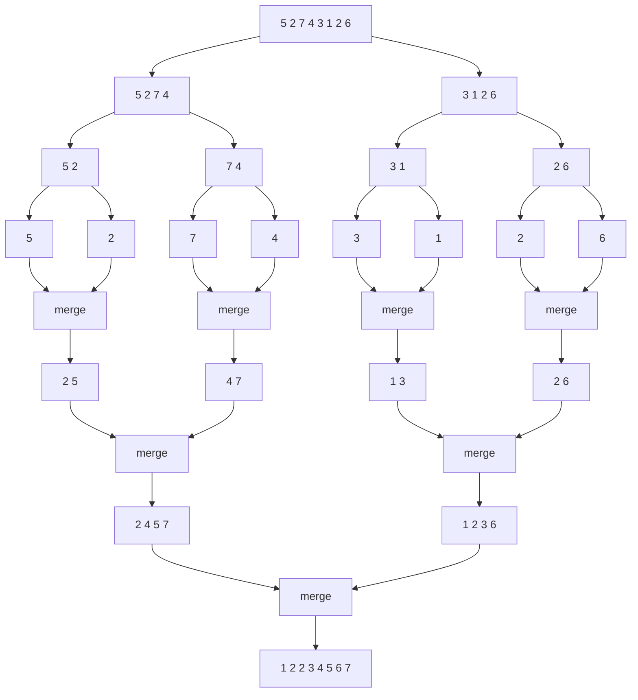

---
title: Merge Sort
type: concept
course: algorithms
week: 1
topic: divide and conquer
tags:
  - algorithms
  - divide-and-conquer
  - week1
  - concept
related:
  - [[week1-divide_and_conquer/pseudocode/Merge Sort|Merge Sort pseudocode]]
  - [[week1-divide_and_conquer/concepts/Recurrences|Recurrences]]
  - [[week1-divide_and_conquer/concepts/Master Theorem|Master Theorem]]
  - [[week1-divide_and_conquer/Week1 Dashboard|Week1 Dashboard]]
---

- applies the divide and conquer approaches to sorting

![[Pasted image 20251128183817.png]]

![[Pasted image 20251128183828.png]]

- *Input:* one array $A[n]$ of size $n$

### Overview

### Example

