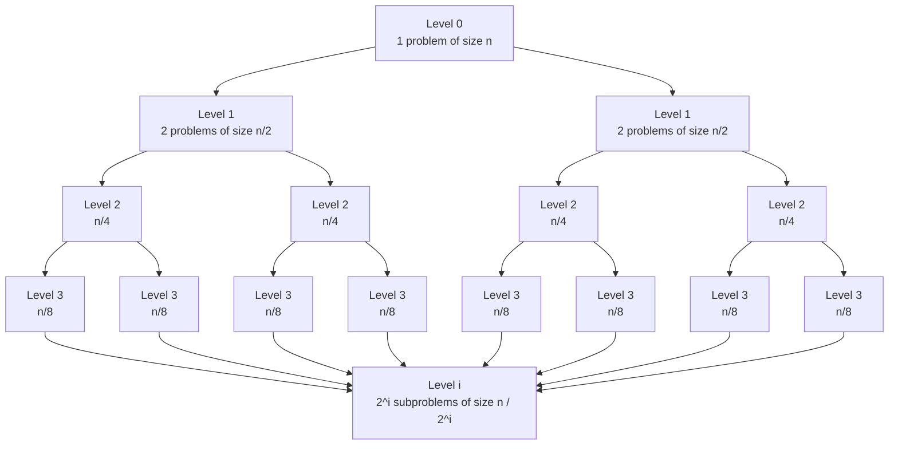

- Ex. $T(n) = 2T(n/2) + O(n)

- Total work on level $i$:
	- $(2^i)*(\frac{n}{2^i}) = n$
	- this problem stops when we have subproblems of size 1
		- so $i = log_2 n$
	- $T(n) = \Sigma_{i=0} 2^i(\frac{n}{2^i}) = n \Sigma_{i=0}^{log_2 n} = n*log_2 n$
	- 
