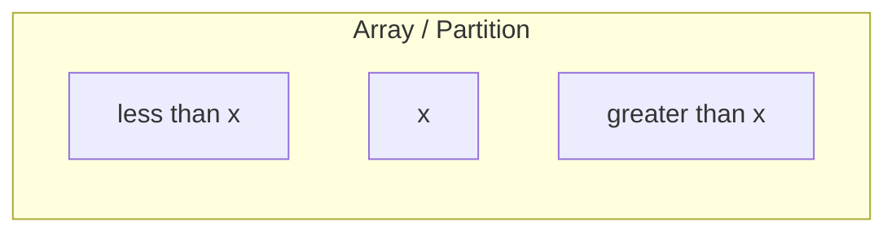

- does merge sort have disadvantages?
	- space complexity
		- requires an additional input array
			- space complexity is $\Theta(n)$
		- "does not sort in place"
#### New goal for sorting algorithms
- find a sorting algorithm as fast as merge sort that sorts in place
- *Idea:* move the data while you're dividing
	- divide/conquer in one step, not divide and then conquer 

#### Quicksort
- very practical with tuning
- Divide (called "partitioning")
	- partition the input array into 2 subarrays around a pivot value $x$
	- after partition:

- Conquer
	- recursively sort the two subarrays
- There is no combine step
	- we sort the arrays in place

#### Partitioning bias
- Quicksort is particularly prone
	- each pivot element ends up occupying exactly the element it will occupy in the sorted order
