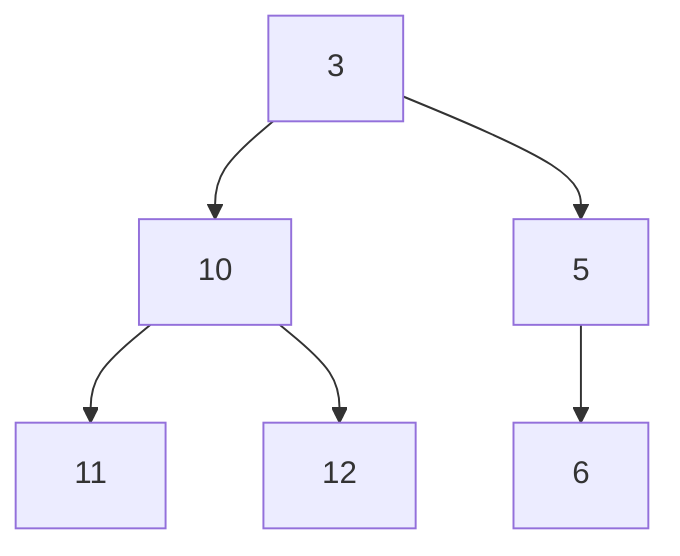
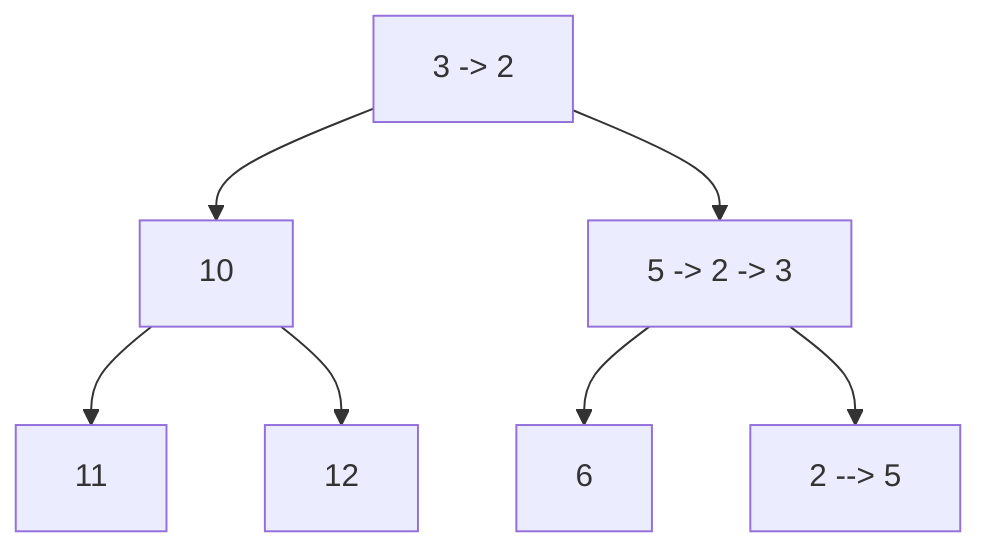
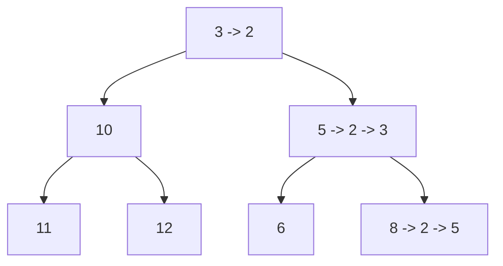

- a heap is an implementation of an abstract data type called a *priority queue*

## Priority Queues
- we will examine them in terms of minimums
	- can also have a maximum priority queue
- maintains a set $S$ of elements $x$
	- each element $x$ is associated with a numeric key vlaue $k$

### Supported Operations
- $insert(S,x)$
	- insert item into the set
- $min(S)$
	- returns the minimum element in $S$
- $extractMin(S)$
	- returns the minimum element and removes it from the heap
- $decreaseKey(S,x,k)$
	- decreases the value of $key[x]$ to a new value $k$

### Implementation
- Array
	- unordered array of key values
	- for all potential elements, key values are initially set to infinity
	- $Insert$ or $decreaseKey$ operations occur in $O(1)$ time
	- $extractMin$ operation requires $O(n)$ time
- Binary Heap
	- an array represented as a nearly-complete binary tree

| Index | 1   | 2   | 3   | 4   | 5   | 6   |
| ----- | --- | --- | --- | --- | --- | --- |
| Value | 3   | 10  | 15  | 11  | 12  | 6   |

- min-heap representation of the array:

- the height of a heap in this way is $log\ n$
- elements are stored in the nearly complete binary tree
	- each level is filled from left to right
	- each level must be full before the next level is started

#### Heap as a tree
- $root$: the first element of the array ($i = 1$)
- $parent(i)$: $\lfloor \frac{i}{2} \rfloor$ for all $i > 1$ (represents the index of the parent)
- $left(i)$: $2i$ (index of the left child)
- $right(i): $2i+1$ (index of right child)
- no pointers are needed, these items can be referenced directly by position (fast!)

##### Min-heap property
- an ordering constraint/invariant
> "The key of the parent of $i$ must $\leq key[i]$ for all $i > 1$"

#### Insert
- Place a new element at the bottom of the tree
	- located at the first available position
	- if smaller than the parent swap the two and repeat

#### Decrease

