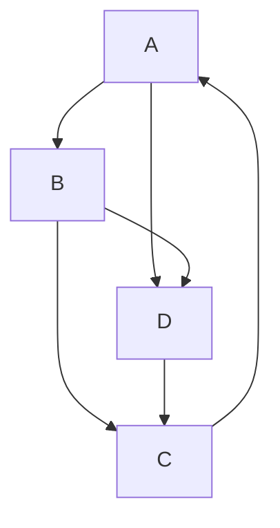
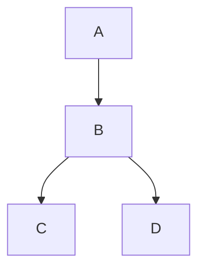

#### Adjacency List
a: b,d
b: c,d
c: a
d: c

#### DFS Table

|       | A   | B   | C   | D   |
| ----- | --- | --- | --- | --- |
| d     | 1   | 2   | 3   | 5   |
| f     | 8   | 7   | 4   | 6   |
| $\Pi$ | NIL | A   | B   | B   |

#### DFS Tree

- $A$ is the root of the search tree
	- all other vertices are its descendents
		- $A$ is an ancestor of $B,C,D$
			- $B$ also has descendents: $C,D$