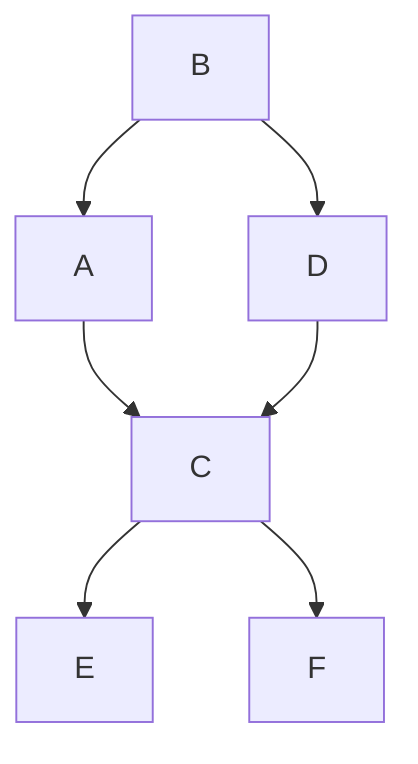

- Let $G$ be a directed graph
	- $G$ is acyclic if it contains no directed cycles

#### Example

- how can we determine if a directed graph is acyclic?
	- DFS - if there are no back edges, it's acyclic
		- $\therefore, \Theta(V+E)$