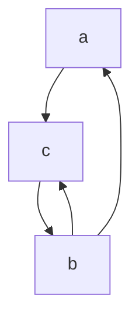
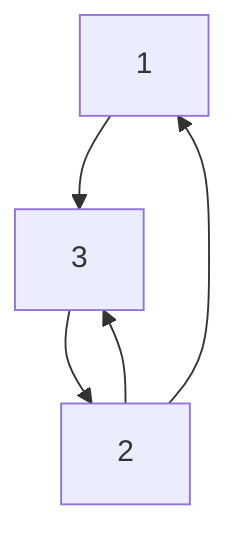

### Adjacency List representation
- $V =$ a set of vertices
- adjacency list representation is an array of $|V|$ linked lists
	- for each vertex $u \in V$, $Adj.[u]=$ the list of vertices adjacent to $u$

#### Example

- Adjacency list:
a: c
b: c, a
c: b

- adjacency list representation is good for sparse graphs
	- $|E| << |V|^2$
	- space requirement: $\Theta(V+E)$

### Adjacency matrix representation
- Assume $V = \{ 1,2, \dots, |V|\}$
- Let $A = (a_{ij}) = |V| * |V|$ matrix
	- $a_{ij} = 1$ if $ij$ is an edge in $G$, 0 otherwise
#### Example

$$
\begin{bmatrix}
0 & 0 & 1 \\
1 & 0 & 1 \\
0 & 1 & 0
\end{bmatrix}
$$
- adjacency matrices are good for dense graphs
	- where $|E|$ ~ $|V|^2$
	- space requirement: $\Theta(V^2)$
