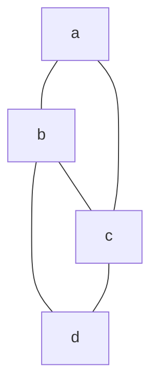
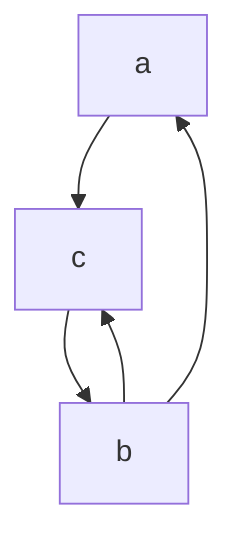

- a *graph* is a set of vertices and a set of edges connecting pairs of vertices
	- $V =$ a finite set of vertices ($V \neq 0$)
	- $E =$ a set of edges
		- expressed as vertex pairs
		- if $G$ is a directed graph, then the edge is an ordered pair
			- e.g. $(u,v$) corresponds to $u->v$
		- if $G$ is an undirected graph, then the edge is an unordered pair
			- e.g. ($u,v$) and ($v,u$) both correspond to $u-v$

- **Undirected graph example**

- $V = \{ a,b,c,d \}$
- $E = \{(a,b),(a,c),(b,c),(b,d),(c,d)\}$
	- Note: as this is an undirected graph, $(u,v) = (v,u)$

- **Directed graph example**

- $V = \{a,b,c\}$
- $E = \{(a,c),(b,a),(b,c),(c,b)\}$
- Note: loops are expressed as $(v,v)$ for $v \in V$
	- multiple loops for one vertex are generally not allowed
- A graph has 2 parameters describing it's size
	- $|V|=$ the number of vertices
	- $|E| =$ the number of edges ($0 \leq |E| \leq |V|^2$)