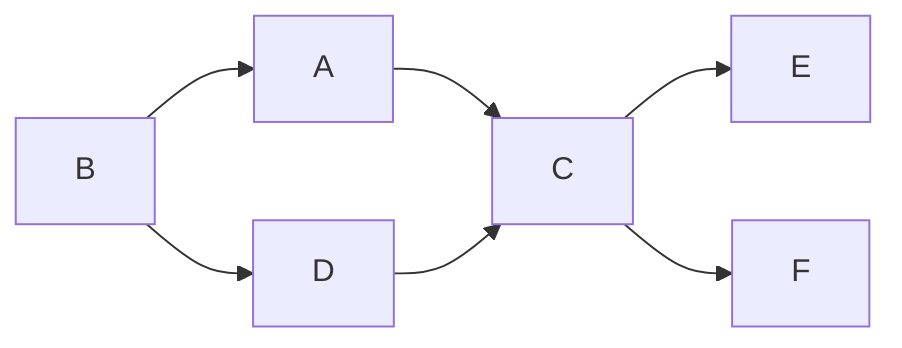
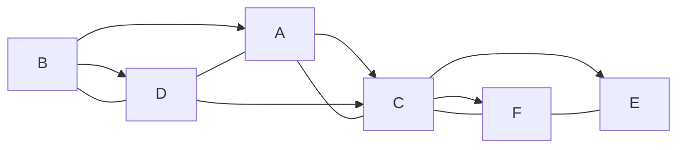

- *Input:* a directed acyclic graph $G=(V,E)$
- *Output:* a list of vertices $v_1,v_2,\dots,v_n$ such that all edges go from left to right
- also called "linearizing" or "flattening"

### Job Scheduling
- $V =$ a set of tasks
- $E =$ a set of dependencies
	- e.g. an edge ($u,v$) indicates that $u$ must be done before $v$
- the goal is to complete all tasks without violating dependencies
#### Example

##### DFS table
|       | A   | B   | C   | D   | E   | F   |
| ----- | --- | --- | --- | --- | --- | --- |
| d     | 1   | 9   | 2   | 10  | 3   | 5   |
| f     | 8   | 12  | 7   | 11  | 4   | 6   |
| $\Pi$ | NIL | NIL | A   | B   | C   | C   |
##### Topological Sort

