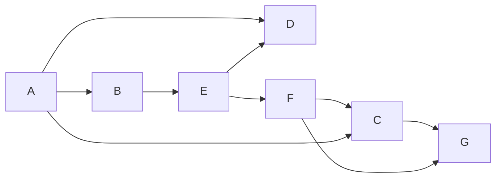
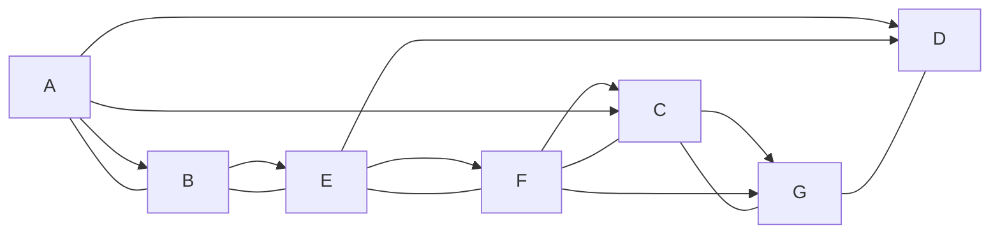

# Prompt
>"Run the DFS-based topological sort algorithm from class on the following graph. Whenever you have a choice of vertices, pick the one that is alphabetically first. Begin with vertex A.

### Part a
>List the discovery times $d[v]$ and finishing times $f[v]$ of each of the vertices

|        | A   | B   | C   | D   | E   | F   | G   |
| ------ | --- | --- | --- | --- | --- | --- | --- |
| $d[v]$ | 1   | 2   | 7   | 4   | 3   | 6   | 8   |
| $f[v]$ | 14  | 13  | 10  | 5   | 12  | 11  | 9   |
### Part b
>"What topological ordering is found by the algorithm?

### Part c
>"How many valid topological orderings does this graph have? Justify briefly.

- as $D$ has dependencies, but no node is dependent on $D$, $D$ can be placed at any point after it's predecessors $A,B,E$
	- there are 4 valid spots for $D$, so there are $4$ valid topological sorts for this graph
