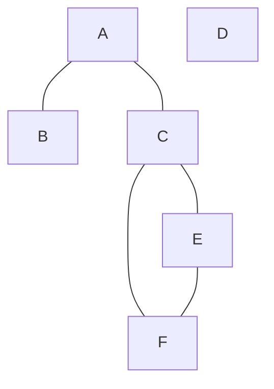
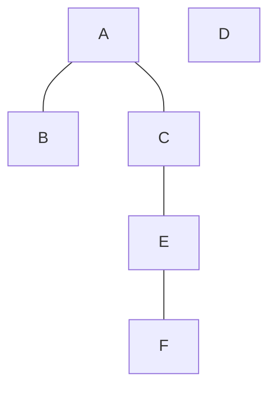

- Input: $G=(V,E)$, directed or undirected, in adjacency list format
- Goal: explore every vertex and every edge
- Output:
	- $d[v]$, the discovery time of vertex $v$
	- $f[v]$, the finishing time of vertex $v$
	- $\Pi[v]$, the parent of $v$ on the DFS tree

```
def DFS(G):
	for each vertex u in V:
		color[u] = WHITE
		parent[u] = NIL
	time = 0
	for each vertex u in V:
		if color[u] = WHITE:
			DFS-Visit(G,u)
```

```
def DFS-Visit(G,u):
	time = time + 1
	d[u] = time
	color[u] = GRAY
	for each v in Adj.[u]:
		if color[v] = WHITE:
			parent[v] = u
			DFS-Visit(G,v)
	color[u] = BLACK
	time = time + 1
	f[u] = time
```

### Runtime Analysis
- $\texttt{DFS-Visit}$ runs on each vertex exactly once
	- during $\texttt{DFS-Visit}$:
		- a fixed amount of work is done on each vertex marking it as visited, marking the parent, as well as the discovery and finishing times
		- a for loop scans adjacent edges to see if they lead to a new vertex
		- total work: $O(V)$
- over the entirety of the algorithm, each edge $(x,y)$ is examined exactly twice, once during $\texttt{DFS-Visit(x)}$ and once during $\texttt{DFS-Visit}(y)$
	- total work: $O(E)$
- total work of the entire algorithm: $\Theta(V+E)$

#### Example


##### Adjacency list:
a: b,c
b: a
c: a, e, f
d: //
e: f,c
f: e, c

#### DFS Table

|        | A   | B   | C   | D   | E   | F   |
| ------ | --- | --- | --- | --- | --- | --- |
| d      | 1   | 2   | 4   | 11  | 5   | 6   |
| f      | 10  | 3   | 9   | 12  | 8   | 7   |
| parent | NIL | A   | A   | NIL | C   | E   |
|        |     |     |     |     |     |     |
##### DFS Tree


