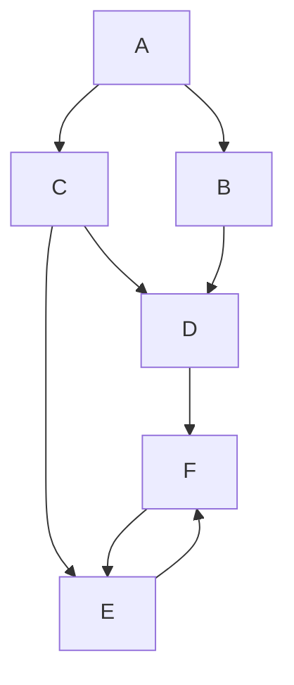
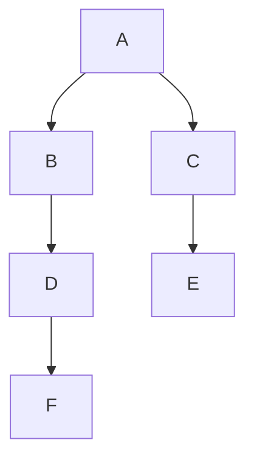

- *Input:* $G= (V,E), S$
	- can be directed or undirected
	- $S$ is the source vertex
- *Output:* a BFS tree rooted at $S$
	- $d[v]=$ the distance from $S$ to $v$
		- the minimum number of edges in the path from $S$ to $v$
	- $\Pi[v]=$ the parent or predecessor of $v$ on the tree
- **Runtime:** $O(V+E)$
- BFS is a *greedy* algorithm
	- "what is first/closest is shortest"

### Example

a: b,c
b: d
c: d,e
d: f
e: f
f: e

#### BFS Tree

- BFS Trees are not necessarily unique
	- the distance from the source is the invariant

#### Vertex Status
- white
	- not yet discovered/scanned
- not white
	- already discovered/scanned
- gray
	- discovered, but not finished
- black
	- finished

### BFS Process
- maintain 3 separate variables for each vertex
	- color
	- distance of $x$ from the source
	- the parent of $x$
- maintain a list of gray vertices in order of discovered
	- when discovered, add the vertex to the end of the list
		- when finished, remove the vertex from the beginning of the list
			- *FIFO: First In, First Out*
			- this is best implemented as a linked list
				- two required operations to support:
					- $\texttt{enqueue(Q,key)}$ appends an item to the linked list in $O(1)$ time
					- $\texttt{dequeue(Q)}$ removes the first item from the list in $O(1)$ time
				- **invariant**: only gray vertices are in the queue
