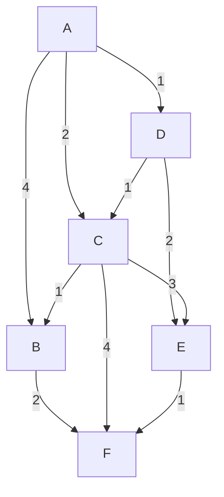
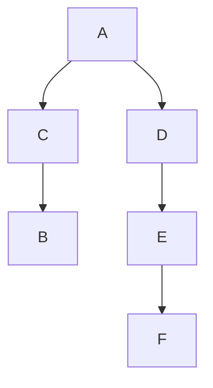
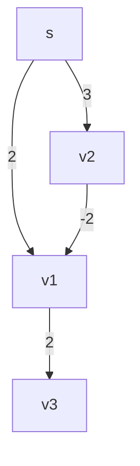

*Input:* $G = (V,E), w, s$
- $G$ is in adjacency list format
- $w$ is a weight function $w: E -> \mathbb{R}$
	- $(\forall e \in E)(w(e) \geq 0)$
- $s \in V$

*Output:* 
- $d[v]$: distance = minimum weight of shortest paths from $s$ to $v4
- $\Pi[v]$: predecessor/parent on shortest path tree

### Example

##### Adjacency List
a: b,c,d
b: f
c: b,e,f
d: c,e
e: f

##### Tables

| d   | A   | B   | C   | D   | E   | F   |
| --- | --- | --- | --- | --- | --- | --- |
|     | 0   | 4   | 2   | 1   | 3   | 4   |
|     |     |     |     |     |     |     |

| $\Pi$ | A   | B   | C   | D   | E   | F   |
| ----- | --- | --- | --- | --- | --- | --- |
|       | NIL | C   | A   | A   | D   | E   |

##### BFS Tree

### Limitations
- Dijkstra's algorithm does not handle negative weights properly

#### Example

##### Adjacency List
s: v1, v2
v1: v3
v2: v1

|      | s   | v1  | v2  | v3  |
| ---- | --- | --- | --- | --- |
| d    | 0   | 1   | 3   | 4   |
| $Pi$ | NIL | v2  | S   | V1  |
##### What's the issue?
- $\delta(s,v_3) = 3$
- $d[v_3] = 4$
	- Dijkstra's is not able to reliably account for negative paths