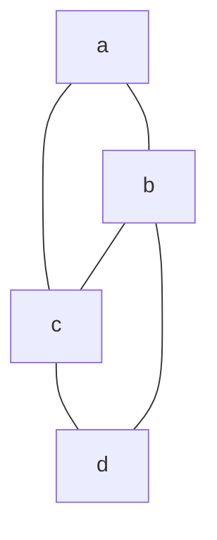

- a path from $u->v$ in a graph $G=(V,E)$ is a sequence of adjacent vertices $u=v+0, \dots, v_k = v$ in $V$
	- the length of the path is the number of edges in the path
- a path is *simple* if there are no repeated vertices

### Example

- ($a,b,c,d$) is a path of length 3 from $a$ to $d$
- ($a,b,d$) is a path of length 2 from $a$ to $d$

- the *distance* form $u$ to $v$, $dist(u,v) = \delta(u,v)$ is the length of the shortest path from $u$ to $v$
	- ($a,b,d$) and ($a,c,d$) are both shortest paths from $a$ to $d$