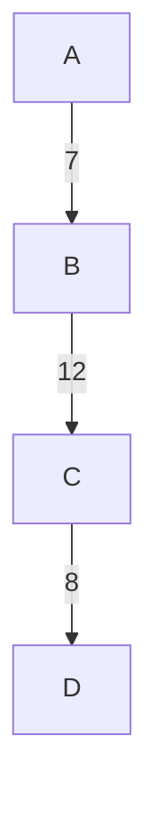
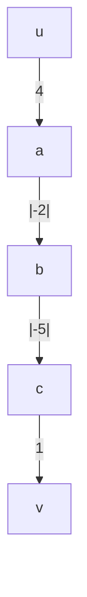
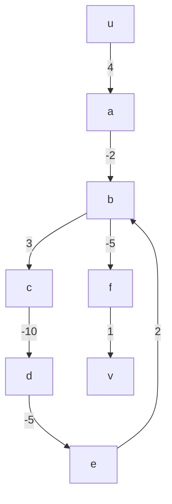

- a weighted directed graph is a directed graph together with a weight function
	- $G = (V,E,w)$ 
		- $w: E -> \mathbb{R}$
			- this associates a real number with each edge
#### Example

- if there is a path in $G$, the weight of the path is the sum of the weights of the edges along the path
	- $p: v_1 -> v_k, w(p) = \Sigma_{i=1}^{k-1} w(v_i,v_{ih})$
	- the shortest path is no longer the fewest number of edges but rather the minimum weight in any path from $u$ to $v$
		- $\delta(u,v) = min(w(p):p\ from\ u\ to\ v)$

### When do shortest paths not exist?
- when a graph has negative edges weights, a shortest path may not exist

- this is okay

- because there is a cycle with negative weight ($b,c,d,e,b$), there is no shortest path
	- you can traverse this cycle infinitely to create a cycle with negative infinity weight

- if a vertex is not reachable from another, $\delta(u,v) = \infty$
