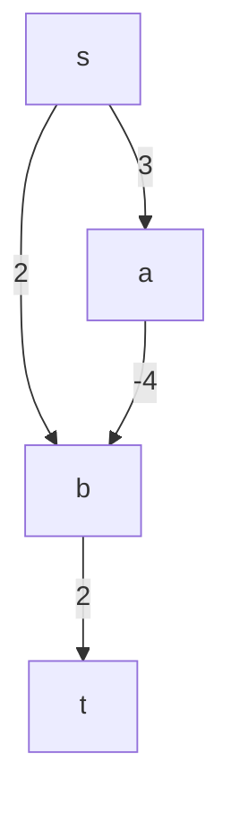

# Prompt
>"Given the weighted directed graph $G$ below with source vertex $s$ and target vertex $t$. Run Dijkstra's algorithm on $G$ starting at $s$ to find the shortest path from $s$ to $t$

### Part a
>"What does Dijkstra's algorithm return? For each vertex in $G$, write the $d$ value computed by the algorithm

|       | s     | a   | b   | t   |
| ----- | ----- | --- | --- | --- |
| d     | 0     | 3   | 2   | 4   |
| $\Pi$ | $NIL$ | s   | s   | b   |
### Part b
>"What is the length of the shortest path from $s$ to $t$?

- the shortest path from $s$ to $t$ is ($s,a,b,t$), which has a total cost of $1$
