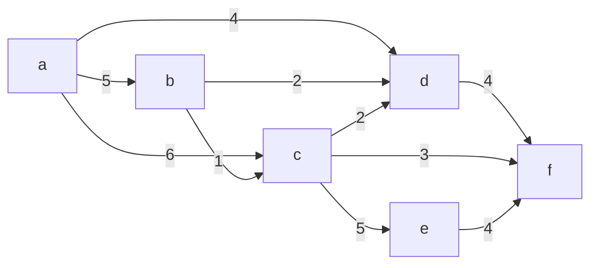
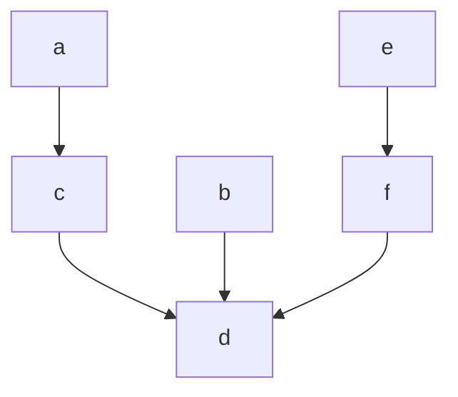

- a greedy approach to finding MSTs

### Procedure
- sort the edges by weight
- choose any edge with the smallest weight
- add it to the MST
- repeat the process
	- after the first, we need to test to ensure that a cycle is not formed
- *Question:* How to check if adding an edge to $T$ would create a cycle?
	- maintain a set for each connected component
		- if $u,v$ in different connected components, add ($u,v$) to $T$
			- merge the connected components $u$ and $v$ are in
- In this algorithm, each vertex begins in its own unique connected component
	- $\texttt{makeset(u)}$ - create a set containing only $u$
- the algorithm tests pairs of vertices to determine whether they belong to the same connected component
	- $\texttt{find(u)}$ - what set does $u$ belong to
- when we add an edge, join two connected components
	- $\texttt{union}(u,v)$ - merge the sets containing $u$ and $v$

### Example

#### Sorted Edges
$(A,C,1),(B,D,1),(E,F,1),(A,B,2),(B,C,2),(C,D,2),(C,E,3),(D,E,3),D,F,4)$

#### Returned tables
|        | A   | B   | C   | D   | E   | F   |
| ------ | --- | --- | --- | --- | --- | --- |
| parent | C   | D   | D   | D   | F   | D   |
| rank   | 0   | 0   | 1   | 3   | 0   | 1   |

##### Final connected components

