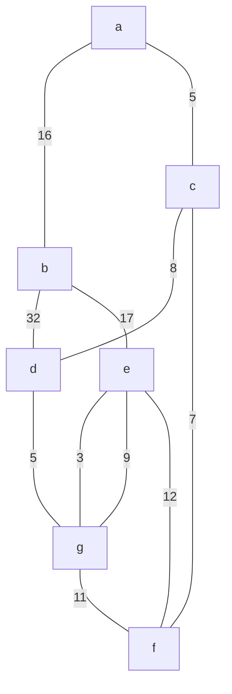
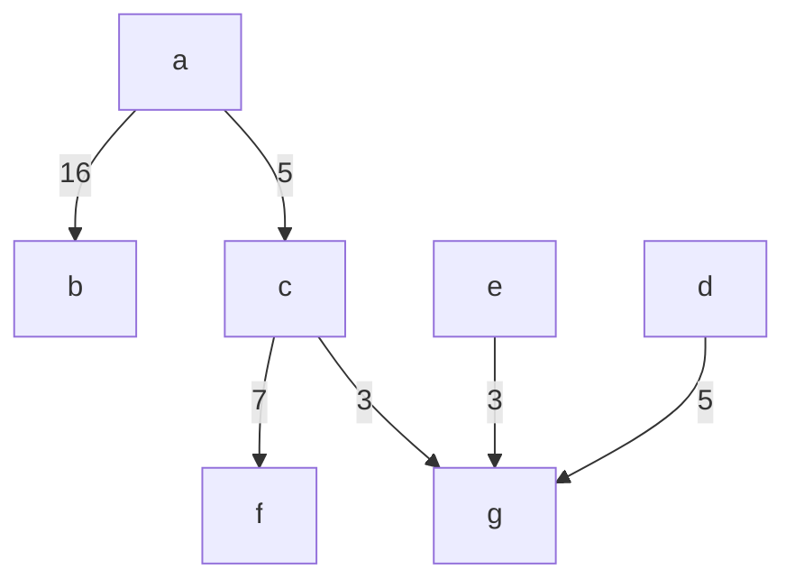

- *Input:* a connected undirected graph $G = (V,E)$ with a weight function $w: E -> \mathbb{R}$
	- no constraint on the weights
- *Output:* a spanning tree with minimum weight
	- $T = (V,E'), E' \subset E$

### Example

#### Approaches
- look all the weights and select the minimum weight
	- use this edge in the spanning tree
- proceed to the next and repeat until a spanning tree that connects to all edges is yielded

### Greedy Algorithms
- this is an example of a greedy approach to generate an MST
	- always picks the best option at the time
		- never backtracks to consider other options
- the *greedy choice property*
	- locally optimal choices lead to a globally optimal solution