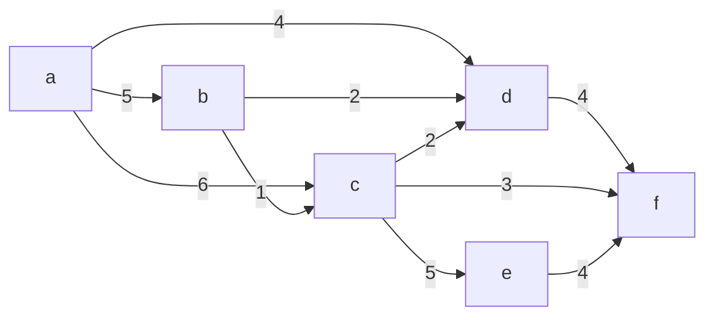
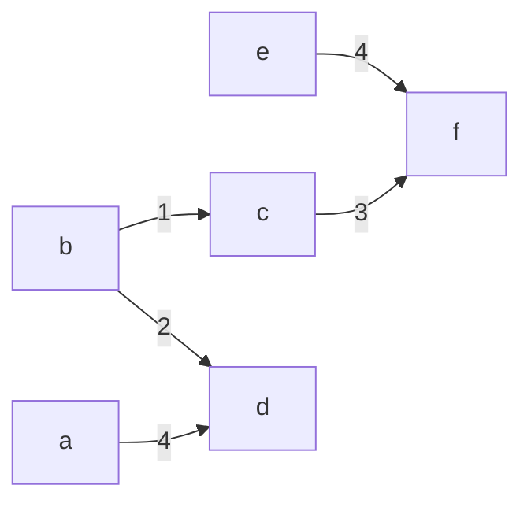

- a greedy approach similar to Kruskal's
	- but more methodical
- starts at a root and begins growing the tree from the root
	- at each point, selects the least weighted edge with exactly 1 vertex already in the tree
		- let $S$ be a subset of vertices in the current tree $T$
			- adding the cheapest edge with exactly one endpoint in $S$ means that this edge crosses the cut
				- by the cut property, this means that this $e$ must be in some MST

- **Question:** How can we find the cheapest edge with exactly one endpoint in $S$
	- use a min-priority queue
		- use Dijkstra's algorithm to find the local edges
		- then delete the min to determine the next edge to add to $T$
	- the cut in this case is ($T, V-T$)
		- e.g. the current tree is on one side of the cut, and all remaining vertices are on the other

### Example

#### Adjacency List
a: b,c,d
b: a,c,d
c: a,b,d,e,f
d: a,b,c,f
e: c,f
f: c,d,e

##### Tables
|        | A   | B   | C   | D   | E   | F   |
| ------ | --- | --- | --- | --- | --- | --- |
| key    | 0   | 2   | 1   | 4   | 4   | 3   |
| parent | NIL | D   | C   | A   | F   | C   |
| mark   | 1   | 1   | 1   | 1   | 1   | 1   |
- Output:

|        | A   | B   | C   | D   | E   | F   |
| ------ | --- | --- | --- | --- | --- | --- |
| key    | 0   | 2   | 1   | 4   | 4   | 3   |
| parent | NIL | D   | B   | A   | F   | C   |
- $(B,D),(C,B),(D,A),(E,F),(F,C)$
	- this corresponds to the following MST

