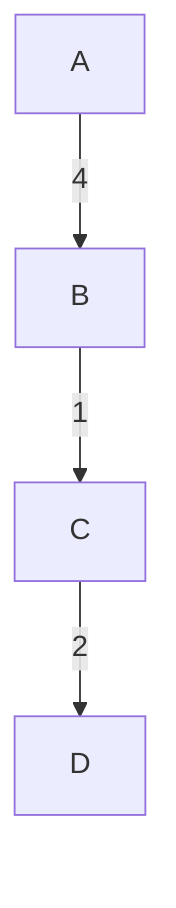

### Part a
>"Let ($S,T$) be a cut of a connected undirected weighted graph $G = (V,E) (i.e. $S \cup T = V$ and  $S \cap T = 0$). Assume there are $k > 1$ edges $e_1, e_2, \dots e_k$ crossing the cut such that the weights of all edges are distinct.
>Prove or disprove: the heaviest edge crossing the cut is not in any minimum spanning tree of $G$.

- this statement is false. Consider this graph:

- this graph is a tree so:
	- it's connected
	- it has $|V| -1$ edges
	- this is automatically an MST with total weight $7$
- let us consider the following cut:
	- $S=\{A,C\}, T =\{B,D\}$
	- every edge in the graph crosses this cut, including edge $AB$, which is the heaviest edge crossing the cut
		- as this edge is part of the MST of $G$, and also crosses the cut, the statement is disproven
### Part b
>" Let $e$ be an edge in a minimum spanning tree $T$ of a connceted undirected weighted graph $G = (V,E)$.
>Prove or disprove: there exists a cut (i.e. a partition of $V$) for which $e$ is a minimum-weight edge crossing the cut (possibly with ties).

##### Proof
- let $e = (u,v)$ be any edge in the MST $T$
	- let us define the cut from $T$ by deleting $e$
		- since $T$ is a tree, deleting any single edge divides the tree into exactly two connected components
			- Let $S$ be the connected component containing $u$, and let $V-S$ be the connected component containing $v$
				- As such, $S, V-S$ is a cut of $G$, and $e$ crosses the cut
					- it should be noted that $e$ is the only edge crossing this cut
	- let us assume towards contraction that there was another edge $f=(x,y)$ that also crossed with cut with a lighted weight
		- $f = (x,y) \in E$ such that $x \in S, y \in V-S$ and $w(f) < w(e)$
		- let us declare a new tree $T' = T - e + f$
			- $T'$ still spans every vertex in $G$ and is acyclic, which is a valid spanning tree with a lower weight than $T$
				- this is a contradiction that contradicts our assumption that $T$ was an MST and so the statement is proven
