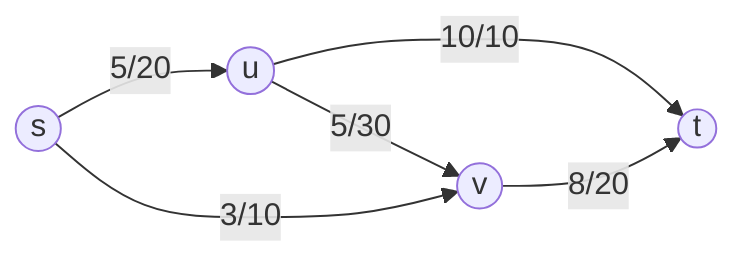

consider the following graph

this is a valid flow, but it's not optimal

### Greedy approach
- find an $s -> t$ directed path in $G$
	- always choose the maximum capacity edge
- find the minimum capacity of edges on the path
	- $c(p) = m \{c(u,v)\}: (u,v)$ where ($u,v$) is an edge on the path
- assign $f(e) = c(p)$ for all edges on the path
- repeat until no $s -> t$ path remains in $G$