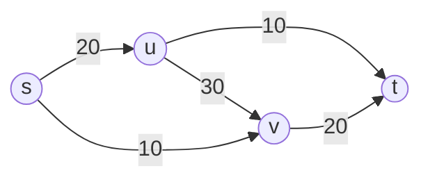
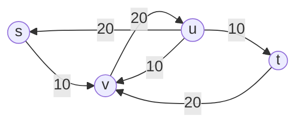
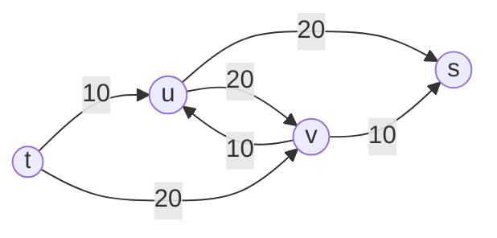

#### Edges in the residual graph
- forward edges
	- for each edge ($u,v$) in $G$ for which $f(u,v) < c(u,v)$
		- create edge ($u,v$) in $G_f$ and assign it capacity $c_f(u,v) = c(u,v) - f(u,v)$
			- this signifies we can increase flow to this edge
- backward edges
	- for each edges ($u,v$) in $G$ for which $f(u,v) > 0$
		- create edge ($u,v$) in $G_f$ and assign it capacity $c_f(u,v) = f(u,v)$
			- this signifies we can decrease existing flow

##### $G$

##### $G_f$

- can push additional flow along the augmented path up $c(p) = min\{c_f(u,v), (u,v) of p\}$

- augmented flow in $G$
	- $f'(e) = f(e) + c_f(p)$
		- if $e$ is a forward edge
	- $f'(e) = f(e) - c_f(p)$
		- if $e$ is a backward edge

- consider graph $G_f'$

- there is no longer an $s -> t$ path
	- *claim:* this graph represents a maximum flow