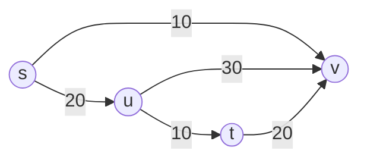

*definition:* an $s -> t$ cut is a cut where $s \in S$ and $t \in V-S = T$
*definition*: the capacity of a cut $c(S,T) = \Sigma_{u \in S} \Sigma_{v \in T} c(u,v)$

#### Cuts for the above graph
$S_1 = \{s\} \{u,v,t\};\ c(S,T) = 20$
$S_2 = \{s,u\} \{v,t\};\ c(S,T) = 50$
$S_3 = \{s,v\} \{u,t\};\ c(S,T) = 40$
$S_4 = \{s,u,v\},\{t\}; c(S,T) = 30$

- *definition:* the flow across a cut $f(s) = f(S,T) = \Sigma_{u \in S} \Sigma_{v \in T} f(u,v) - \Sigma \Sigma f(v,u)$