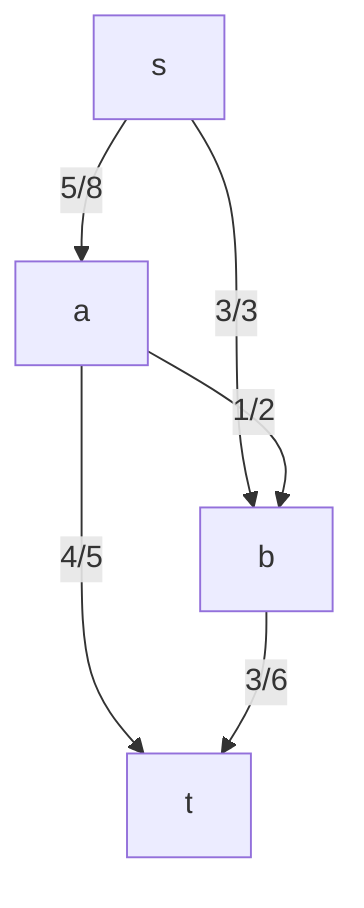
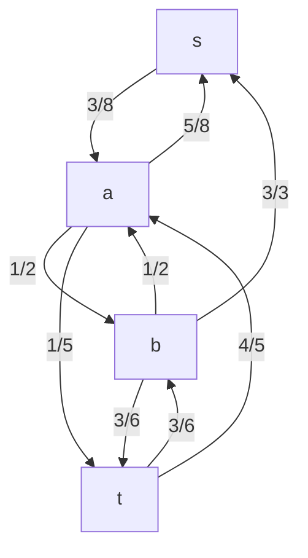

# Prompt
>You are given the following directed graph $G$ with capacities and current flow |c/f|

### Part a
>Construct the residual graph $G_f$. For each edge, state both the forward and backward residual capacities

### Part b
>List all $s-t$ augmenting paths in the residual graph
- $s -> a - > t$
- $s -> a -> b -> t$
### Part c
>Give the maximum possible residual capacity of the augmenting paths you listed in part b

- for path $s->a->t$, the bottleneck vertex is $(a,t), which has a residual capacity of 1
- for path $s ->a->b->t$, the bottleneck vertex is $(a,b)$, which has a residual capacity of 1