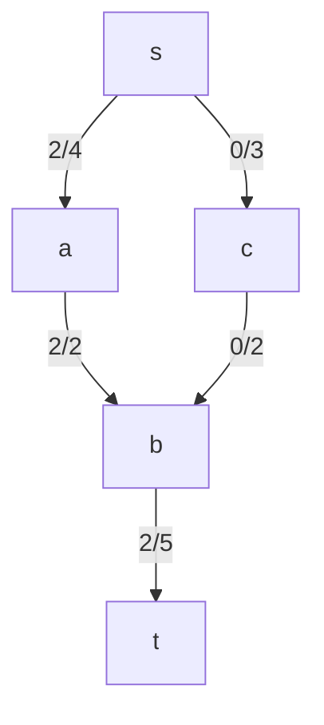
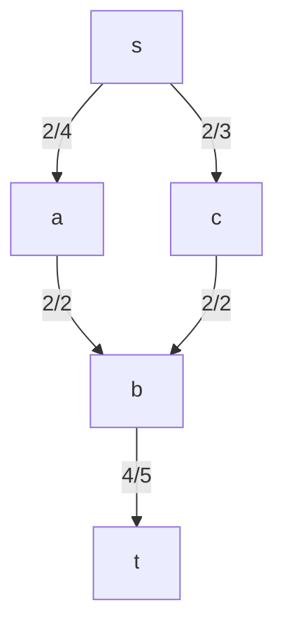

# Prompt
>You are given a flow network $G=(V,E,c)$

### Part a
>Draw or list the residual edges and their residual capacities

- Forward edges
	- s->a: 4-2 = 2
	- s->c: 3-0 = 3
	- c->b: 2-0=2
	- b->t: 5-2=3
- Backward edges:
	- a->s: 2
	- b->a: 2
	- t->b: 2
### Part b
>Run one iteration of Ford-Fulkerson using any augmenting path you find. State:
>	the augmenting path
>	the bottleneck capacity
>	the updated flows along each edge

- the augmenting path is $s->c->b->t$
	- the residual capacities along this path are:
		- $f(s,c): 3$
		- $f(c,b): 2$
		- $f(b,t): 3$
			- as such, the bottleneck along this augmenting path is $c->b$, which has a residual capacity of $2$.
- the updated flows are from:
	- $f(s,c)$ changes from $0$ to $2$
	- $f(c,b)$ changes from $0$ to $2$
	- $f(b,t)$ changes from $2$ to $4$
### Part c
>After your augmentation, which edges (if any) gain new backward residual edges?

- edge $(c,s)$ gains a back edge with residual capacity 2
- edge $(c,b)$ gains a back edge with a residual capacity two
- it is not a new back edge, but edge $(t,b)$ had its capacity increased from $2$ to $4$