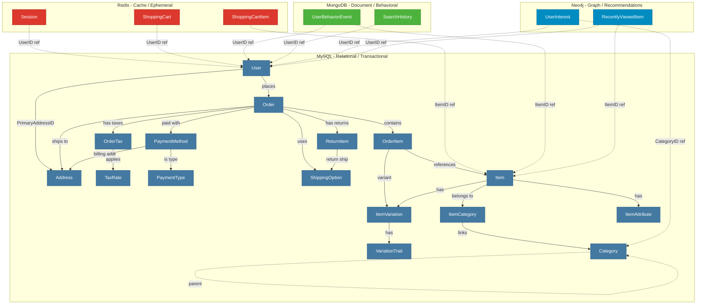

```mermaid
flowchart TD
    classDef mysql fill:#4479A1,color:#fff,stroke:#2d5f8a
    classDef mongo fill:#4DB33D,color:#fff,stroke:#3a8a2e
    classDef redis fill:#DC382D,color:#fff,stroke:#a82920
    classDef neo4j fill:#008CC1,color:#fff,stroke:#006a94

    subgraph MYSQL["MySQL - Relational / Transactional"]
        User
        Address
        Order
        OrderItem
        OrderTax
        TaxRate
        PaymentMethod
        PaymentType
        ShippingOption
        ReturnItem
        Item
        ItemVariation
        VariationTrait
        Category
        ItemCategory
        ItemAttribute
    end

    subgraph MONGODB["MongoDB - Document / Behavioral"]
        UserBehaviorEvent
        SearchHistory
    end

    subgraph REDIS["Redis - Cache / Ephemeral"]
        Session
        ShoppingCart
        ShoppingCartItem
    end

    subgraph NEO4J["Neo4j - Graph / Recommendations"]
        UserInterest
        RecentlyViewedItem
    end

    %% --- MySQL internal relationships ---
    User -->|PrimaryAddressID| Address
    User -->|places| Order
    Order -->|contains| OrderItem
    Order -->|ships to| Address
    Order -->|uses| ShippingOption
    Order -->|paid with| PaymentMethod
    Order -->|has taxes| OrderTax
    Order -->|has returns| ReturnItem
    OrderTax -->|applies| TaxRate
    PaymentMethod -->|is type| PaymentType
    PaymentMethod -->|billing addr| Address
    OrderItem -->|references| Item
    OrderItem -->|variant| ItemVariation
    ReturnItem -->|return ship| ShippingOption
    Item -->|has| ItemVariation
    Item -->|has| ItemAttribute
    Item -->|belongs to| ItemCategory
    ItemVariation -->|has| VariationTrait
    ItemCategory -->|links| Category
    Category -.->|parent| Category

    %% --- Cross-database references (app-layer, not enforced by DB) ---
    Session -.->|UserID ref| User
    ShoppingCart -.->|UserID ref| User
    ShoppingCartItem -.->|ItemID ref| Item
    UserBehaviorEvent -.->|UserID ref| User
    UserBehaviorEvent -.->|ItemID ref| Item
    SearchHistory -.->|UserID ref| User
    UserInterest -.->|UserID ref| User
    UserInterest -.->|CategoryID ref| Category
    RecentlyViewedItem -.->|UserID ref| User
    RecentlyViewedItem -.->|ItemID ref| Item

    class User,Address,Order,OrderItem,OrderTax,TaxRate,PaymentMethod,PaymentType,ShippingOption,ReturnItem,Item,ItemVariation,VariationTrait,Category,ItemCategory,ItemAttribute mysql
    class UserBehaviorEvent,SearchHistory mongo
    class Session,ShoppingCart,ShoppingCartItem redis
    class UserInterest,RecentlyViewedItem neo4j
```
